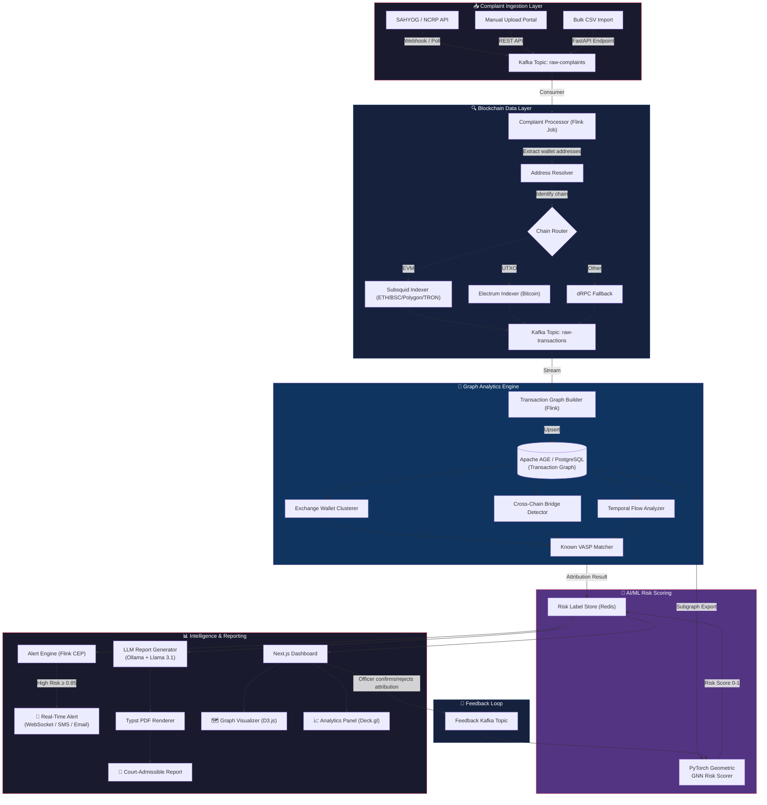
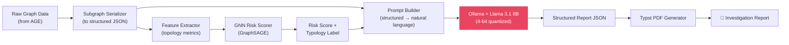

# 🔗 Project CHAINWATCH — Master Plan Document
## Real-Time Identification of Fraud-Linked Cryptocurrency Exchanges via Automated Blockchain Analytics
### Smart India Hackathon 2026 | Team Submission

---

## Table of Contents
1. [The Hackathon Pitch](#1-the-hackathon-pitch)
2. [The Ultimate Tech Stack](#2-the-ultimate-tech-stack)
3. [System Architecture Diagram](#3-system-architecture-diagram)
4. [Advanced Tracing & Clustering Algorithms](#4-advanced-tracing--clustering-algorithms)
5. [AI/GenAI Integration](#5-aigenai-integration)
6. [MVP Sprint Plan](#6-mvp-sprint-plan)
7. [The "Unhappy Path" Strategy](#7-the-unhappy-path-strategy)
8. [Appendix: Key Data Schemas & API Contracts](#8-appendix-key-data-schemas--api-contracts)

---

## 1. The Hackathon Pitch

> **Hook**: In India, cyber fraud losses exceeded ₹1,750 crore in 2024, with cryptocurrency increasingly becoming the exit ramp for stolen funds. Law enforcement officers today spend **72+ hours manually tracing a single suspect wallet** across blockchains — by then, the money is already laundered through mixers, bridges, and offshore exchanges. **We kill that delay.**

**CHAINWATCH** is a real-time blockchain forensics engine purpose-built for Indian Law Enforcement Agencies. It ingests victim-reported suspect wallet addresses directly from SAHYOG/NCRP complaint pipelines, then unleashes a **temporal graph neural network** across a **streaming blockchain index** to automatically trace, cluster, and attribute fund flows to known VASPs and exchanges — in **under 90 seconds**, not 72 hours. Unlike commercial tools like Chainalysis that cost ₹2Cr+/year and operate as black boxes, CHAINWATCH is **open-source, sovereign, and explainable**: every attribution carries a court-admissible evidence chain generated by a fine-tuned LLM that translates raw graph topology into plain-English investigative narratives. We don't just find where the money went — we hand the officer a **freeze-ready intelligence packet** with the exchange name, KYC jurisdiction, suggested RFI template, and a risk confidence score, all before the fraudster's morning coffee.

---

## 2. The Ultimate Tech Stack

### 2.1 Technology Selection Matrix

| Layer | Technology | Why This Is The Best Choice |
|---|---|---|
| **Graph Database** | **Apache AGE (PostgreSQL extension)** | Runs graph queries (openCypher) *inside* PostgreSQL. We get the reliability and ecosystem of Postgres + native graph traversal. No separate infra. TigerGraph is faster at extreme scale but proprietary and complex to deploy. Neo4j Community Edition has clustering limitations. AGE gives us the sweet spot of power, simplicity, and zero licensing cost. |
| **Streaming Engine** | **Apache Kafka + Flink** | Kafka for durable event ingestion (complaint queue, blockchain tx stream). Flink for stateful stream processing with exactly-once semantics. We need to detect patterns *as transactions happen*, not in batch. Flink's CEP (Complex Event Processing) library lets us define laundering pattern rules declaratively. |
| **Blockchain Indexer** | **Subsquid (EVM) + Custom Bitcoin Electrum Indexer** | Subsquid offers a decentralized data lake for EVM chains — no rate-limited RPC calls. For Bitcoin/UTXO chains, we run a lightweight Electrum-protocol indexer against a pruned full node. This avoids the ₹15L+/year cost of enterprise indexing APIs. |
| **RPC / Node Access** | **dRPC (decentralized RPC)** + **Self-hosted Bitcoin Core (pruned)** | dRPC aggregates multiple node providers for redundancy and speed. For Bitcoin (the primary chain in Indian crypto fraud), a pruned node (~10GB) gives us full query capability without 600GB+ storage. |
| **ML/AI Framework** | **PyTorch Geometric (PyG)** for GNNs + **Ollama** for local LLM inference | PyG is the gold standard for graph neural networks — purpose-built for node classification and link prediction on transaction graphs. Ollama lets us run quantized LLMs (Llama 3.1 8B / Mistral 7B) locally with zero API cost and full data sovereignty — critical for LEA data. |
| **Backend API** | **FastAPI (Python)** | Async-native, auto-generates OpenAPI docs, first-class Pydantic validation. The fastest Python web framework, and the entire team already knows Python. |
| **Frontend Dashboard** | **Next.js 14 + D3.js + Deck.gl** | Next.js for SSR/SSG performance. D3.js for interactive force-directed graph visualizations of wallet clusters. Deck.gl for geo-mapping exchange jurisdictions at scale. |
| **Evidence & Reporting** | **Typst** (programmatic PDF generation) | Generates court-admissible PDF reports from structured data. Faster and more programmable than LaTeX. Supports Hindi/English bilingual output. |
| **Caching & Search** | **Redis (time-series + pub/sub)** + **Meilisearch** | Redis for real-time alert pub/sub and caching hot wallet lookups. Meilisearch for typo-tolerant, instant search across wallet addresses, complaint IDs, and entity names. |
| **Orchestration** | **Docker Compose** (MVP) → **K3s** (production) | Lightweight Kubernetes for single-node deployment at LEA offices. Docker Compose for hackathon demo. |
| **CI/CD & Monitoring** | **GitHub Actions + Grafana + Prometheus** | Standard, battle-tested observability. |

### 2.2 Why NOT These Alternatives

| Rejected Technology | Reason |
|---|---|
| **Neo4j Enterprise** | Clustering requires Enterprise license ($$). Community Edition is single-instance only. AGE on Postgres gives us the same query power with native SQL fallback. |
| **TigerGraph** | Overkill for MVP. Proprietary. Complex deployment. Better for 100B+ edge graphs; we're operating at 10M-100M edges initially. |
| **The Graph Protocol** | Designed for DeFi subgraphs, not forensic trace queries. No support for cross-chain joins or temporal windowing. |
| **Chainalysis / Elliptic APIs** | ₹2Cr+/year. Black-box attribution. Data leaves India. Defeats the "sovereign, open-source" narrative. We *reference* their published heuristics but build our own engine. |
| **Spark/Hadoop** | Batch-oriented. We need sub-second streaming. Flink is the correct tool. |

---

## 3. System Architecture Diagram

### 3.1 High-Level Data Flow



### 3.2 Detailed Cross-Chain Tracing Flow

```mermaid
sequenceDiagram
    participant LEA as 👮 LEA Officer
    participant API as FastAPI Gateway
    participant Kafka as Kafka
    participant Flink as Flink Pipeline
    participant AGE as Apache AGE (Graph DB)
    participant GNN as GNN Risk Scorer
    participant LLM as LLM Report Gen
    participant Dash as Dashboard

    LEA->>API: POST /trace {wallet: "0xABC...", chain: "ethereum"}
    API->>Kafka: Publish to trace-requests
    Kafka->>Flink: Consume trace request
    
    rect rgb(15, 52, 96)
        Note over Flink,AGE: Phase 1: Forward Trace (3 hops)
        Flink->>AGE: Fetch outgoing txns from 0xABC
        AGE-->>Flink: 47 transactions found
        Flink->>Flink: Recursive BFS (depth=3, fan-out cap=50)
        Flink->>AGE: Upsert discovered subgraph
    end
    
    rect rgb(83, 52, 131)
        Note over Flink,AGE: Phase 2: Clustering & Attribution
        Flink->>AGE: Run exchange clustering query
        AGE-->>Flink: Cluster match: WazirX deposit wallet (87% confidence)
        Flink->>AGE: Check cross-chain bridges in subgraph
        AGE-->>Flink: Bridge detected: ETH→BSC via Multichain
        Flink->>Flink: Spawn BSC trace (recursive)
    end
    
    rect rgb(233, 69, 96)
        Note over GNN,LLM: Phase 3: Risk Scoring & Reporting
        Flink->>GNN: Submit subgraph for scoring
        GNN-->>Flink: Risk=0.92 (Layering pattern detected)
        Flink->>LLM: Generate investigative narrative
        LLM-->>Flink: "Funds from suspect wallet 0xABC were split across 3 intermediary wallets within 12 minutes, then consolidated and deposited into a WazirX hot wallet..."
        Flink->>Dash: Push result via WebSocket
    end
    
    Dash->>LEA: 🚨 Alert: High-risk attribution found
    LEA->>Dash: View interactive graph + Download PDF report
```



---

## 4. Advanced Tracing & Clustering Algorithms

### 4.1 Exchange Wallet Clustering (The Core Innovation)

We implement **four complementary heuristics** that together achieve high-accuracy exchange identification without any paid API:

#### Heuristic 1: Deposit Address Reuse Detection (Bitcoin UTXO)

```
PRINCIPLE: Exchange deposit addresses receive funds from many unrelated 
senders but always forward to a small set of hot wallets.

ALGORITHM:
1. For each address A in the trace subgraph:
   - Count unique senders: |in_degree(A)|
   - Count unique receivers: |out_degree(A)|  
   - If in_degree(A) > 20 AND out_degree(A) ≤ 3:
     → Flag as POTENTIAL_DEPOSIT_ADDRESS
2. For flagged addresses, check if their outputs converge:
   - If ≥5 flagged addresses all send to the same wallet H:
     → H is a HOT_WALLET candidate
     → All flagged addresses belong to the same exchange cluster
3. Cross-reference H against our Known Exchange Hot Wallet DB
   (seeded from public OSINT: OXT.me, Arkham Intel, WalletExplorer)
```

#### Heuristic 2: Temporal Consolidation Pattern (EVM)

```
PRINCIPLE: Exchanges periodically sweep deposit wallets into a 
consolidation wallet in batch transactions.

ALGORITHM:
1. Detect "sweep events": transactions where:
   - Multiple inputs from distinct addresses occur within a 
     Δt ≤ 10 block window
   - All outputs go to the same destination
   - Gas is paid by a consistent fee-payer address
2. The fee-payer is likely an exchange-controlled sweeper bot
3. Cluster all swept addresses + fee-payer + destination as one entity
```

#### Heuristic 3: Contract Interaction Fingerprinting (DeFi Attribution)

```
PRINCIPLE: Exchange hot wallets interact with a characteristic set 
of smart contracts (their own withdrawal contracts, staking, etc.)

ALGORITHM:
1. For each candidate wallet, extract its top-20 interacted contracts
2. Compare against a fingerprint library of known exchange contracts:
   - WazirX: [0x123..., 0x456...]
   - CoinDCX: [0x789..., 0xABC...]
   - Binance: [0xDEF..., 0x012...]
3. Jaccard similarity > 0.6 → attribute to that exchange
```

> [!TIP]
> We build the fingerprint library by scraping Etherscan's "Exchange" label page and running our own clustering on their known addresses. This is a **one-time bootstrap** that makes all subsequent traces instant.

#### Heuristic 4: Graph Neural Network — Supervised Node Classification

This is our **differentiator**. We train a GNN to classify wallet nodes as:
- `EXCHANGE_HOT` | `EXCHANGE_DEPOSIT` | `MIXER` | `DEFI_PROTOCOL` | `PERSONAL` | `SCAM`

```
MODEL: GraphSAGE (Inductive Learning)
WHY GraphSAGE: Unlike transductive models (GCN, GAT), GraphSAGE 
generalizes to UNSEEN nodes — critical because new wallets appear 
every second.

FEATURES PER NODE (12-dimensional):
 1. in_degree (log-scaled)
 2. out_degree (log-scaled)
 3. total_volume_received (ETH, log-scaled)
 4. total_volume_sent (ETH, log-scaled)
 5. active_lifespan_days
 6. avg_time_between_txns (seconds)
 7. unique_counterparties
 8. max_single_txn_value
 9. std_dev_txn_values
10. contract_interaction_count
11. is_contract (boolean)
12. token_diversity (unique ERC-20 tokens transacted)

TRAINING DATA: 
- Positive labels from Etherscan/OFAC tagged addresses (~50K)
- Augmented with our own clustering results (semi-supervised)

INFERENCE:
- Extract 2-hop ego subgraph around target wallet
- Run GraphSAGE forward pass → softmax → class probabilities
- Time: ~15ms per wallet on CPU
```

### 4.2 Cross-Chain Bridge Detection

```mermaid
flowchart LR
    subgraph CHAIN_A["Ethereum"]
        A1["Suspect Wallet"] -->|"Deposit 5 ETH"| A2["Bridge Contract\n(e.g., Multichain)"]
    end
    
    subgraph BRIDGE["🌉 Bridge Detection Logic"]
        A2 -.->|"Event: Lock(5 ETH, dest=BSC, to=0xDEF)"| B1["Bridge Event Parser"]
        B1 -->|"Correlate by:\n1. Amount (±0.1%)\n2. Timestamp (±30min)\n3. Bridge contract mapping"| B2["Cross-Chain Link"]
    end
    
    subgraph CHAIN_B["BSC"]
        B2 -.->|"Match"| C1["Bridge Mint Contract"]
        C1 -->|"Mint 5 BNB-pegged ETH"| C2["Destination Wallet\n0xDEF..."]
        C2 -->|"Swap + Deposit"| C3["Exchange Wallet\n(attributed: Binance)"]
    end
    
    style CHAIN_A fill:#627eea,stroke:#fff,color:#fff
    style BRIDGE fill:#f0b90b,stroke:#fff,color:#000
    style CHAIN_B fill:#f0b90b,stroke:#fff,color:#000
```



**Implementation:**
1. **Maintain a Bridge Contract Registry**: Map known bridge contracts (Multichain, Wormhole, Stargate, LayerZero, cBridge) to their cross-chain counterpart contracts.
2. **Parse Lock/Burn Events**: When a transaction in our trace hits a known bridge contract, parse the event logs for destination chain, amount, and recipient.
3. **Probabilistic Cross-Chain Correlation**: On the destination chain, search for mint/release events within a time window matching:
   - Amount: within ±0.5% (accounting for bridge fees)
   - Timestamp: within ±30 minutes (accounting for finality delays)
   - Recipient: exact match if available in event data
4. **Confidence Score**: Assign correlation confidence based on how many parameters match.

### 4.3 Laundering Topology Detection via Flink CEP

We define **temporal pattern rules** in Flink's CEP library to detect known laundering typologies in real-time:

```java
// Pattern: "Peel Chain" — classic Bitcoin laundering technique
// Funds are peeled off in small amounts across many hops
Pattern<Transaction, ?> peelChain = Pattern
    .<Transaction>begin("start")
    .where(new SimpleCondition<Transaction>() {
        public boolean filter(Transaction tx) {
            return tx.getValue() > threshold;
        }
    })
    .followedBy("peel")
    .where(tx -> tx.getChange() > 0.8 * tx.getInput()) // >80% goes to change
    .timesOrMore(3)  // at least 3 peeling hops
    .within(Time.hours(24));  // within 24 hours
```

**Detected Typologies:**
| Typology | Pattern Signature | Confidence |
|---|---|---|
| **Peel Chain** | Linear chain, each hop peels small amount, >80% to change address | High |
| **Fan-Out/Fan-In** | 1→N split followed by N→1 consolidation within 48h | High |
| **Round-Trip** | A→B→C→...→A (cycle detection via DFS) | Medium |
| **Rapid Bridge Hop** | ≥3 cross-chain bridges within 24h | High |
| **Mixer Interaction** | Deposit to known mixer contract, withdrawal from different address with matching amount (±fee) | Medium |
| **Smurfing** | Multiple small deposits to same exchange from related wallets, all below reporting threshold | High |

---

## 5. AI/GenAI Integration

### 5.1 Architecture: The "Analyst-in-a-Box" Pipeline



### 5.2 LLM Report Generation — Prompt Engineering

We do NOT ask the LLM to "analyze blockchain data." That would be unreliable. Instead, we:

1. **Pre-compute all analytics** (graph metrics, risk scores, attribution results) using deterministic algorithms.
2. **Feed structured facts** to the LLM with a strict output schema.
3. **Ask the LLM only to narrate** — convert structured data into human-readable investigative prose.

**Example System Prompt:**
```
You are a cryptocurrency forensic analyst writing an investigation 
report for Indian Law Enforcement. You will receive structured JSON 
containing:
- Suspect wallet address and chain
- Transaction trace results (hops, amounts, timestamps)
- Attributed exchange/VASP (if identified)
- Risk score and detected laundering typology
- Key intermediary wallets

Generate a professional investigative narrative in the following 
sections:
1. EXECUTIVE SUMMARY (2-3 sentences)
2. FUND FLOW NARRATIVE (chronological, plain English)
3. KEY FINDINGS (bullet points)
4. RECOMMENDED ACTIONS (freeze requests, RFI templates)
5. EVIDENCE CHAIN (hash references for each claim)

Rules:
- Every factual claim MUST reference a transaction hash
- Use IST timestamps
- Be precise with amounts (to 8 decimal places for BTC, 
  18 for ETH)
- Language: English with Hindi translation for summary section
- Output MUST be valid JSON matching the provided schema
```

**Example Input to LLM:**
```json
{
  "suspect_wallet": "0xABC123...",
  "chain": "ethereum",
  "trace_summary": {
    "total_hops": 4,
    "total_value_moved": "12.5 ETH",
    "time_span_hours": 3.2,
    "intermediary_wallets": ["0xDEF...", "0x456...", "0x789..."],
    "terminal_wallet": "0xWAZIRX_HOT...",
    "attributed_exchange": "WazirX",
    "attribution_confidence": 0.87
  },
  "risk_assessment": {
    "risk_score": 0.92,
    "typology": "FAN_OUT_FAN_IN",
    "suspicious_patterns": [
      "3-way split at hop 1 with consolidation at hop 3",
      "All intermediary wallets created within 24h of first transaction",
      "Gas fees paid by a single external wallet (possible automation)"
    ]
  }
}
```

**Example LLM Output (Narrative Section):**
> On 15th August 2026 at 14:32 IST, the suspect wallet `0xABC123...` initiated a transfer of 12.5 ETH (transaction hash: `0xTXN1...`). The funds were immediately split across three intermediary wallets — `0xDEF...`, `0x456...`, and `0x789...` — in a classic fan-out pattern designed to obscure the fund trail. Notably, all three intermediary wallets were created within 24 hours of this transaction, suggesting they are purpose-built burner wallets. Within 3.2 hours, the funds were reconsolidated and deposited into wallet `0xWAZIRX_HOT...`, which our clustering analysis identifies as a WazirX exchange hot wallet with 87% confidence. The automated gas fee pattern (all intermediary transactions funded by wallet `0xGAS...`) is consistent with scripted laundering infrastructure.

### 5.3 AI-Powered Anomaly Detection (Beyond GNN)

| Model | Purpose | Training Data |
|---|---|---|
| **GraphSAGE (Node Classification)** | Classify wallet type (exchange, mixer, personal, scam) | Etherscan labels + OFAC SDN list |
| **Temporal GNN (TGN)** | Detect evolving laundering patterns over time | Synthetic + Elliptic dataset (public) |
| **Isolation Forest** | Flag outlier transaction amounts/timing in a cluster | Unsupervised on live data |
| **Fine-tuned Llama 3.1 8B** | Generate investigative reports | Synthetic investigation reports (we generate training data using GPT-4o, then fine-tune the local model) |

### 5.4 Court Admissibility Strategy

> [!IMPORTANT]
> **The LLM does NOT make factual determinations.** It only narrates pre-computed, deterministic results. Every claim in the report links to a verifiable on-chain transaction hash. The report includes a "Methodology" appendix explaining the algorithms used. This mirrors how forensic tools like EnCase present evidence — the tool presents data, the human expert testifies.

**Report Metadata Includes:**
- SHA-256 hash of the raw input data fed to the system
- Version of all algorithms used
- Timestamp of analysis
- Cryptographic signature of the generated PDF (using the LEA's digital certificate)
- QR code linking to an immutable evidence snapshot (IPFS hash)

---

## 6. MVP Sprint Plan

### 6.1 Hackathon Timeline (Assuming 36-hour sprint)

```mermaid
gantt
    title CHAINWATCH MVP - 36 Hour Sprint Plan
    dateFormat HH:mm
    axisFormat %H:%M

    section Phase 1: Foundation (0-8h)
        Docker Compose setup (Kafka, Postgres+AGE, Redis)    :p1a, 00:00, 3h
        FastAPI skeleton + complaint ingestion API            :p1b, 00:00, 3h
        Bitcoin & Ethereum RPC integration                    :p1c, 03:00, 3h
        Database schema + seed known exchange wallets         :p1d, 03:00, 3h
        Basic Next.js dashboard shell                         :p1e, 02:00, 4h

    section Phase 2: Core Engine (8-20h)
        Transaction graph builder (BFS tracer)                :p2a, 08:00, 4h
        Exchange clustering heuristics (H1 + H2)              :p2b, 08:00, 4h
        Cross-chain bridge detection (top 3 bridges)          :p2c, 12:00, 4h
        D3.js graph visualizer component                      :p2d, 12:00, 4h
        GNN model training (pre-trained + fine-tune)          :p2e, 08:00, 6h
        Alert engine (Redis pub/sub)                          :p2f, 16:00, 4h

    section Phase 3: Intelligence (20-30h)
        LLM report generation pipeline                        :p3a, 20:00, 4h
        PDF report renderer (Typst)                           :p3b, 24:00, 3h
        Dashboard: search, filters, case management           :p3c, 20:00, 6h
        Interactive graph explorer (click-to-expand)          :p3d, 24:00, 4h
        API documentation (auto-generated OpenAPI)            :p3e, 26:00, 2h

    section Phase 4: Polish (30-36h)
        End-to-end demo scenario (scripted)                   :p4a, 30:00, 2h
        Performance optimization + caching                    :p4b, 30:00, 2h
        Presentation deck preparation                         :p4c, 32:00, 4h
        Video demo recording                                  :p4d, 34:00, 2h
```

### 6.2 Task Assignment (6-person team)

| Role | Person | Sprint Focus |
|---|---|---|
| **Backend Lead** | P1 | FastAPI, Kafka consumers, Flink jobs |
| **Blockchain Engineer** | P2 | RPC integration, transaction parsing, bridge detection |
| **Graph/ML Engineer** | P3 | AGE schema, clustering algorithms, GNN training |
| **Frontend Lead** | P4 | Next.js dashboard, D3.js graph viz, Deck.gl maps |
| **AI/NLP Engineer** | P5 | LLM integration, prompt engineering, report generation |
| **DevOps + Demo** | P6 | Docker, CI/CD, seed data, demo scripting, presentation |

### 6.3 MVP Feature Prioritization (MoSCoW)

| Priority | Feature |
|---|---|
| **MUST** | Single-wallet trace (BFS, 3 hops) on Ethereum |
| **MUST** | Exchange wallet matching against known hot wallets DB |
| **MUST** | Interactive graph visualization of trace results |
| **MUST** | Basic risk score (rule-based, not ML) |
| **MUST** | PDF investigation report generation |
| **SHOULD** | GNN-based wallet classification |
| **SHOULD** | Cross-chain bridge detection (ETH↔BSC) |
| **SHOULD** | Real-time alerts via WebSocket |
| **SHOULD** | TRON chain support (critical for Indian fraud cases) |
| **COULD** | LLM-generated narrative in reports |
| **COULD** | Feedback loop for model retraining |
| **COULD** | SAHYOG/NCRP API mock integration |
| **WON'T (this sprint)** | Privacy coin tracing, full Flink CEP rules, production K8s |

### 6.4 Demo Script (The "Wow Moment")

> **The 3-Minute Demo That Wins:**
>
> 1. **[0:00]** "A victim just reported this wallet address to the cyber crime portal..." *(paste address into dashboard)*
> 2. **[0:30]** *System traces 3 hops in real-time, graph animates node-by-node* "Watch as CHAINWATCH traces the money trail..."
> 3. **[1:00]** *Graph highlights a cluster* "It's detected a fan-out laundering pattern — the funds were split across 3 burner wallets..."
> 4. **[1:30]** *Bridge detection fires* "Now it's detected a cross-chain bridge to BSC — the trace continues automatically..."
> 5. **[2:00]** *Exchange attribution appears* "Funds have been attributed to a WazirX deposit wallet with 87% confidence."
> 6. **[2:15]** *Risk score flashes red* "Risk score: 0.92 — High risk. The system has already generated an alert."
> 7. **[2:30]** *Click "Generate Report"* — PDF downloads with full narrative, evidence chain, and recommended freeze actions
> 8. **[2:45]** "This entire trace took 47 seconds. Manual investigation would have taken 3 days. That's the difference between freezing stolen funds and losing them forever."

---

## 7. The "Unhappy Path" Strategy

### 7.1 Obfuscation Techniques & Our Response

> [!WARNING]
> No blockchain forensics tool — not even Chainalysis — can guarantee 100% attribution against sophisticated obfuscation. Our strategy is to be **honest about limitations** while demonstrating **creative partial solutions** that push the state of the art.

#### 7.1.1 Zero-Knowledge Mixers (Tornado Cash, Railgun)

**The Problem:** Tornado Cash uses zk-SNARKs to break the on-chain link between depositor and withdrawer. The mixer contract pools funds; withdrawals are cryptographically unlinkable to deposits.

**Our Approach (Probabilistic Deanonymization):**

```
STRATEGY: "You can't trace THROUGH the mixer, but you can 
trace AROUND it."

1. DEPOSIT-SIDE ANALYSIS:
   - Detect deposit to known mixer contracts
   - Record: amount, denomination, timestamp, depositor address
   - Flag the depositor's entire transaction history

2. WITHDRAWAL-SIDE HEURISTICS:
   - Monitor mixer withdrawal events
   - Apply timing correlation:
     → If deposit and withdrawal occur within a narrow 
       time window AND in the same denomination
     → Probabilistic link (low confidence, ~30-40%)
   - Apply amount correlation:
     → Fixed denominations (0.1, 1, 10, 100 ETH) 
       limit anonymity set
   - Apply gas fee analysis:
     → If withdrawal gas is funded by a wallet linked 
       to the depositor (common OPSEC failure!)
     → High confidence link

3. BEHAVIORAL CLUSTERING:
   - Track the withdrawal address's subsequent behavior
   - If it interacts with the same DeFi protocols, 
     exchanges, or ENS names as the deposit address
   - Probabilistic link via behavioral fingerprinting

4. REPORTING:
   - Even if we can't trace through:
     → We report "Funds entered Tornado Cash (0.1 ETH pool)"
     → We flag ALL withdrawals from that pool in the 
       relevant time window as "potential recipients"
     → The LEA can subpoena exchange KYC for those addresses
```

> [!NOTE]
> **Judge-Impressing Insight:** Tornado Cash was sanctioned by OFAC in August 2022. Most compliant exchanges now reject deposits from Tornado Cash withdrawal addresses. So even if we can't deanonymize the mixer, we can detect that **the funds touched a sanctioned protocol** — which itself is actionable intelligence.

#### 7.1.2 Privacy Coins (Monero, Zcash)

**The Problem:** Monero uses ring signatures, stealth addresses, and RingCT to make transactions fully opaque. Even the amounts are hidden.

**Our Approach:**

```
STRATEGY: "Trace to the on-ramp and off-ramp, not 
through the opaque chain."

1. ON-RAMP DETECTION:
   - Detect when EVM/Bitcoin funds are swapped to XMR:
     → Monitor known atomic swap contracts
     → Monitor DEX trades (e.g., TradeOgre, LocalMonero)
     → Monitor cross-chain bridge events
   - Record: "5 ETH → XMR conversion detected at [timestamp]"

2. OFF-RAMP DETECTION:
   - Monitor known XMR→fiat/stablecoin exchanges
   - If the suspect's XMR eventually converts back to a 
     traceable chain, we pick up the trail there

3. METADATA ANALYSIS (Advanced):
   - Monero transactions leak some metadata:
     → Transaction size (correlates to number of inputs)
     → Timing (Poisson distribution analysis)
     → Network-level IP correlation (if we run Monero nodes)
   - These are RESEARCH-GRADE techniques — we mention them 
     to show depth but don't promise production accuracy

4. HONEST REPORTING:
   - "Fund trail enters Monero at [point]. On-chain tracing 
     is not possible. Recommend: exchange-level investigation 
     of XMR deposit records at [identified exchanges]."
```

#### 7.1.3 Chain-Hopping via Unregistered Bridges

**The Problem:** New, unregistered bridges appear frequently. We can't maintain a complete registry.

**Our Approach:**

```
STRATEGY: "If we can't identify the bridge, detect the 
PATTERN of bridging."

HEURISTIC:
- Transaction sends ETH/tokens to a smart contract that:
  1. Is NOT in our known protocol registry
  2. Has high TVL (Total Value Locked)
  3. Has matching withdrawal patterns on other chains 
     (amount correlation, timing)
  4. Contract bytecode contains cross-chain messaging 
     primitives (LayerZero, Axelar, Hyperlane signatures)

ACTION:
- Flag as "UNKNOWN_BRIDGE" with medium confidence
- Log contract address for manual review
- Add to registry if confirmed (crowdsourced improvement)
```

#### 7.1.4 Dusting Attacks & Decoy Transactions

**The Problem:** Sophisticated actors send tiny amounts ("dust") to thousands of addresses to create false links and confuse graph analysis.

**Our Approach:**
```
FILTER: Ignore transactions below a configurable "dust threshold"
- BTC: < 546 satoshis (non-standard output)
- ETH: < 0.0001 ETH
- ERC-20: < $0.10 equivalent

DETECTION: If an address sends dust to >100 unique addresses 
in 24h → flag as DUST_ATTACKER, exclude from clustering
```

### 7.2 Limitations Disclosure (For Judges)

We include a **"Limitations & Honest Assessment"** section in our presentation:

| Limitation | Mitigation | Transparency Level |
|---|---|---|
| Cannot trace through Tornado Cash with certainty | Probabilistic timing/amount analysis + on/off-ramp detection | ⚠️ Partial solution |
| Cannot trace Monero transactions | On-ramp/off-ramp detection + metadata analysis | ❌ Acknowledged gap |
| GNN accuracy depends on training data quality | Semi-supervised learning + officer feedback loop | ⚠️ Improving over time |
| New/unknown bridges may be missed | Pattern-based detection + community registry | ⚠️ Partial solution |
| False positives in exchange clustering | Confidence scores + human-in-the-loop confirmation | ✅ Addressed by design |

> [!TIP]
> **Hackathon Pro Tip:** Judges respect honesty about limitations FAR more than false claims of 100% accuracy. Presenting a clear-eyed "threat model" demonstrates real-world understanding and maturity. Frame it as: *"We solve 80% of real-world fraud cases where funds move through standard exchanges. For the 20% involving advanced obfuscation, we provide maximum possible intelligence and clear next-step recommendations."*

---

## 8. Appendix: Key Data Schemas & API Contracts

### 8.1 Core Graph Schema (Apache AGE)

```sql
-- Vertex Labels
CREATE VLABEL IF NOT EXISTS wallet;
CREATE VLABEL IF NOT EXISTS transaction;
CREATE VLABEL IF NOT EXISTS exchange;
CREATE VLABEL IF NOT EXISTS bridge;

-- Edge Labels  
CREATE ELABEL IF NOT EXISTS SENT;          -- wallet -> transaction
CREATE ELABEL IF NOT EXISTS RECEIVED;      -- transaction -> wallet
CREATE ELABEL IF NOT EXISTS BELONGS_TO;    -- wallet -> exchange
CREATE ELABEL IF NOT EXISTS BRIDGED_TO;    -- transaction -> transaction (cross-chain)

-- Wallet Properties
-- address: string (unique), chain: string, first_seen: timestamp,
-- last_seen: timestamp, total_received: decimal, total_sent: decimal,
-- tx_count: int, label: string (exchange|mixer|personal|scam|unknown),
-- risk_score: float, cluster_id: int

-- Transaction Properties  
-- hash: string (unique), block_number: int, timestamp: timestamp,
-- value: decimal, fee: decimal, chain: string, 
-- from_address: string, to_address: string,
-- token_address: string (null for native), method_id: string
```

### 8.2 Key API Endpoints

```yaml
# Complaint Ingestion
POST /api/v1/complaints
  body: { wallet_address, chain, complaint_id, source: "SAHYOG"|"NCRP"|"MANUAL" }
  response: { trace_id, status: "QUEUED" }

# Trace Operations  
POST /api/v1/trace
  body: { wallet_address, chain, max_hops: 3, direction: "forward"|"backward"|"both" }
  response: { trace_id, status: "PROCESSING" }

GET /api/v1/trace/{trace_id}
  response: { status, graph: { nodes: [...], edges: [...] }, 
              attributions: [...], risk_score, typology }

# WebSocket for real-time updates
WS /api/v1/trace/{trace_id}/stream
  messages: { type: "NODE_DISCOVERED"|"EDGE_ADDED"|"ATTRIBUTION_FOUND"|"COMPLETE", data: {...} }

# Report Generation
POST /api/v1/reports
  body: { trace_id, format: "PDF"|"JSON", language: "en"|"hi" }
  response: { report_url, generated_at }

# Exchange Database
GET /api/v1/exchanges
  response: [{ name, known_wallets: [...], jurisdiction, kyc_contact }]

# Health & Metrics
GET /api/v1/health
GET /api/v1/metrics  (Prometheus format)
```

### 8.3 Seed Data: Known Indian Exchange Wallets

```json
{
  "exchanges": [
    {
      "name": "WazirX",
      "jurisdiction": "India (Binance subsidiary)",
      "chains": ["ethereum", "bsc", "tron", "bitcoin"],
      "known_hot_wallets": {
        "ethereum": ["0x...list from Etherscan labels..."],
        "bitcoin": ["bc1q...list from WalletExplorer..."]
      },
      "kyc_contact": "compliance@wazirx.com",
      "freeze_sla_hours": 24
    },
    {
      "name": "CoinDCX",
      "jurisdiction": "India",
      "chains": ["ethereum", "bitcoin", "tron"],
      "known_hot_wallets": { "...": "..." }
    },
    {
      "name": "ZebPay",
      "jurisdiction": "India (Singapore entity)",
      "chains": ["ethereum", "bitcoin"],
      "known_hot_wallets": { "...": "..." }
    }
  ]
}
```

---

## 🏆 Why CHAINWATCH Wins

| Evaluation Criteria | Our Edge |
|---|---|
| **Innovation** | GNN-based wallet classification + LLM report generation — no other student team will have this |
| **Feasibility** | Entire stack runs on a single laptop (Docker Compose). No cloud dependency. No paid APIs. |
| **Impact** | Directly addresses ₹1,750Cr+ annual fraud losses. Designed for real LEA workflows (SAHYOG/NCRP). |
| **Scalability** | Streaming architecture (Kafka+Flink) handles 10x-100x load increase without redesign |
| **Sovereignty** | 100% open-source. All data stays in India. No foreign API dependencies. |
| **Technical Depth** | We don't just use a blockchain explorer — we build the forensics engine from first principles |
| **Honesty** | Clear limitations disclosure + "unhappy path" strategy shows mature engineering thinking |

---

*Document Version: 1.0 | Last Updated: September 2026 | Team CHAINWATCH*
